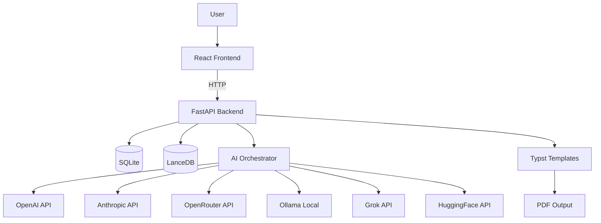

# System Architecture Overview

## High-Level Architecture

CareerForge AI follows a three-tier desktop application architecture:

```
┌─────────────────────────────────────────────────────────┐
│                    Tauri v2 Shell (Rust)                 │
│              Native window, system plugins               │
├─────────────────────────────────────────────────────────┤
│               React/TypeScript Frontend                  │
│            SPA with Zustand state management              │
│              Tailwind CSS design system                   │
├─────────────────────────────────────────────────────────┤
│              FastAPI Python Backend (localhost)           │
│   ┌──────────┐  ┌──────────┐  ┌──────────────────────┐  │
│   │ Routers  │→ │ Services │→ │ Repository + DB      │  │
│   │ (12 API  │  │ (Logic)  │  │ (SQLAlchemy async)    │  │
│   │  groups) │  │          │  │                       │  │
│   └──────────┘  └────┬─────┘  └──────────────────────┘  │
│                      │                                    │
│               ┌──────┴──────┐                             │
│               │ AI Layer    │                             │
│               │ Orchestrator│──→ OpenAI                  │
│               │ Agents      │──→ Anthropic               │
│               │ Knowledge   │──→ OpenRouter               │
│               │ Engine      │──→ Ollama                   │
│               └─────────────┘                             │
├─────────────────────────────────────────────────────────┤
│  SQLite (relational data) + LanceDB (vector embeddings)  │
└─────────────────────────────────────────────────────────┘
```

## Component Interaction



## Key Design Decisions

1. **Local-first architecture** — All data stored locally. No cloud sync.
2. **Provider abstraction** — AI providers are interchangeable through a unified interface.
3. **Evidence-backed generation** — Every resume bullet traces to candidate evidence.
4. **Knowledge graph** — Entities connected through weighted relationships.
5. **Template-driven rendering** — Canonical JSON → Typst → PDF pipeline.
6. **Iterative optimization** — ATS analysis and reflection loops improve quality.
